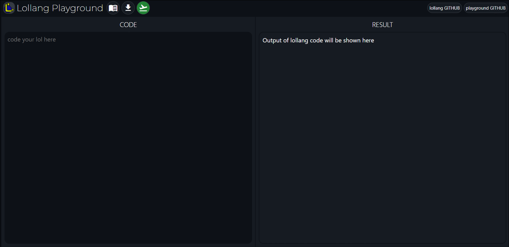
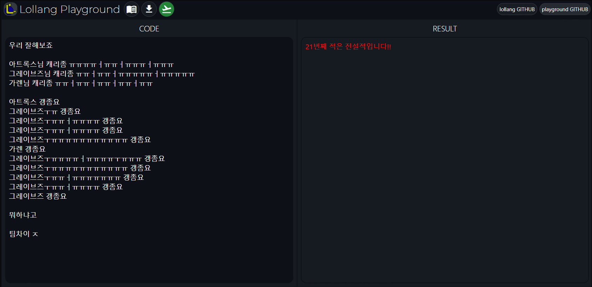
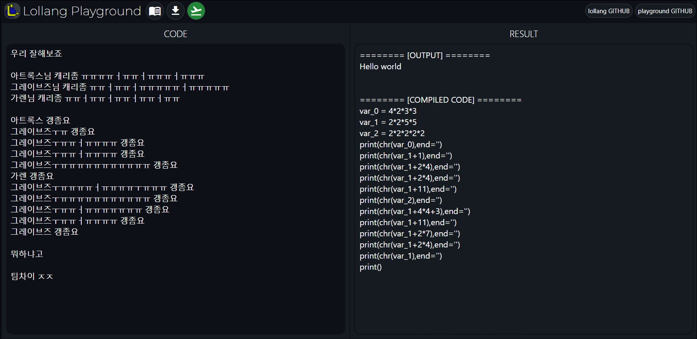

# lollang-playground

lollang코드를 작성하고 결과를 확인할 수 있는 웹 기반 프로그래밍 환경입니다.
열심히 만들고 있습니다.

### 현재 가능한 것

- 컴파일모드의 lollang코드 작성 및 실행
- 출력결과 및 컴파일된 py코드 확인
- lollang코드 다운로드

### 예정사항

- 대화형모드 제공
- 더 나은 코드에디터 제공
- 클라우드로의 코드 저장. URL을 통해 lollang-playground에서 코드 바로 열기.
- 커스텀 테마 제공
  등등..

### 감사한 곳

- lollang by <i>[riroan](https://github.com/riroan)</i> [(Github repo)](https://github.com/riroan/lollang)

- node.js [(Github repo)](https://github.com/nodejs/node)
- rollup [(Github repo)](https://github.com/rollup/rollup)
- Svelte [(Github repo)](https://github.com/sveltejs/svelte)

- Axios [(Github repo)](https://github.com/axios/axios)
- tabOverride <i>by wjbryant</i>[(Github repo)](https://github.com/wjbryant/taboverride)
- indent-textarea <i>by fregante</i>[(Github repo)](https://github.com/fregante/indent-textarea)
- CodeEditor base <i>by Charmaine Chui</i> [(Enable Line Numbering to any HTML Textarea)](https://medium.com/weekly-webtips/enable-line-numbering-to-any-html-textarea-35e15ea320e2)
- Code Highlighting Base <i>by Will Boyd</i> [(Highlight Text Inside a Textarea)](https://codersblock.com/blog/highlight-text-inside-a-textarea/)
- js-loading-overlay <i>by muhdfaiz</i> [(Github repo)](https://github.com/muhdfaiz/js-loading-overlay)
- file-saver <i>by eligrey</i> [(Github repo)](https://github.com/eligrey/FileSaver.js)
